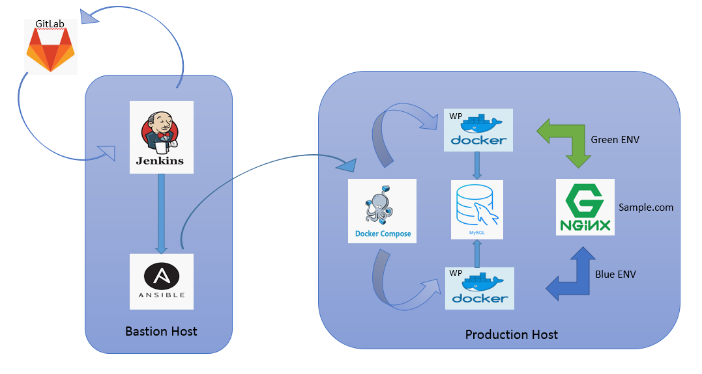

# E-Commerce project
## This project use blue/green deployment for faster delivary updates
# Getting Started
## In this manual you will receive comprehensive information on how 
## to deploy the project automatically
# Prerequisites
## Description of application for deployment
   - WordPress
   - PHP
   - MySql
   - https://github.com/githubamid/project
## Technologies which were used in project
### Orchestration: Jenkins, git
### Automation tools: Ansible, bash
### CI description: by poll, tests, delivery
### Blue/Green Deployment

